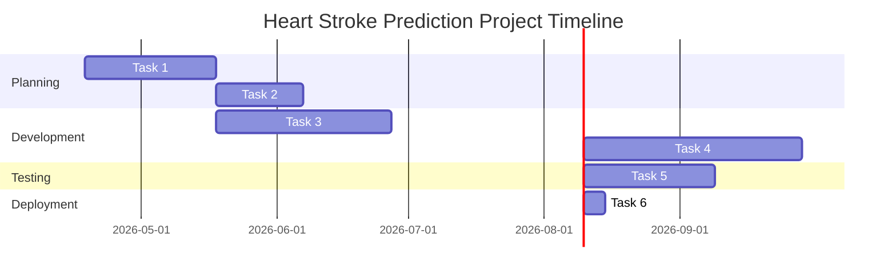
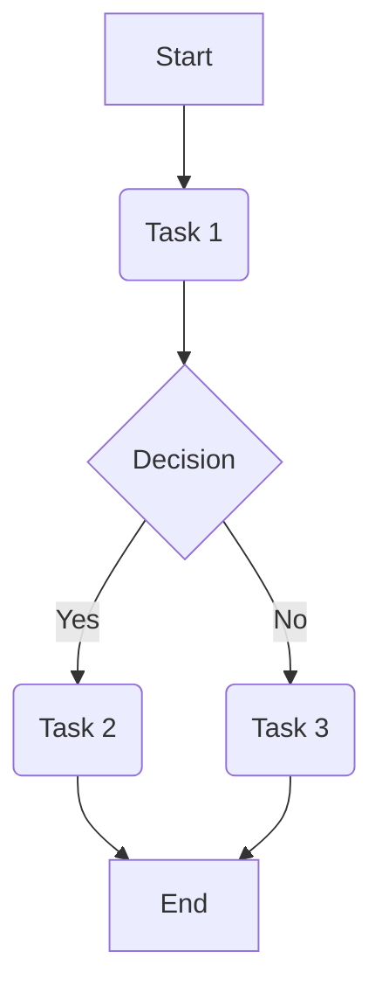
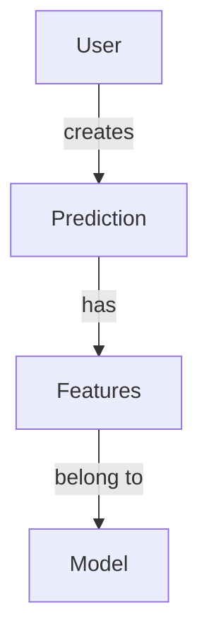
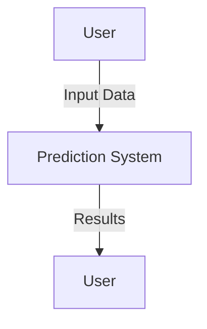
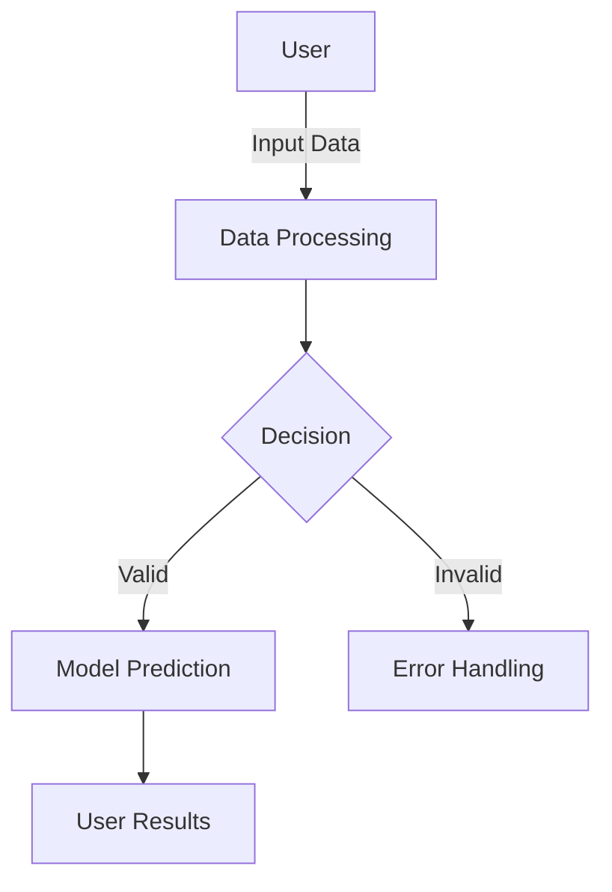
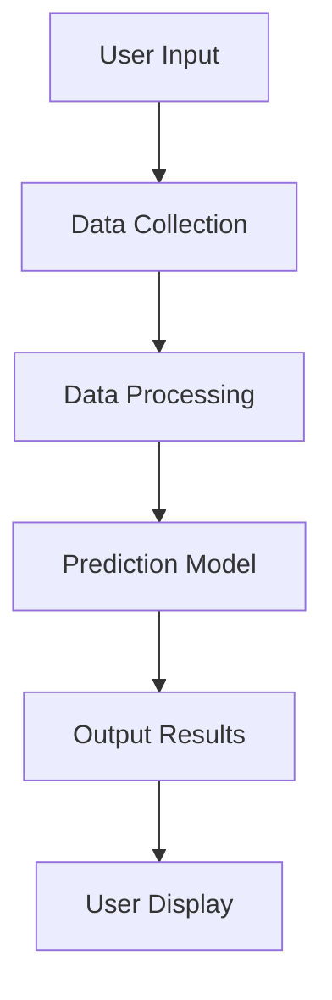
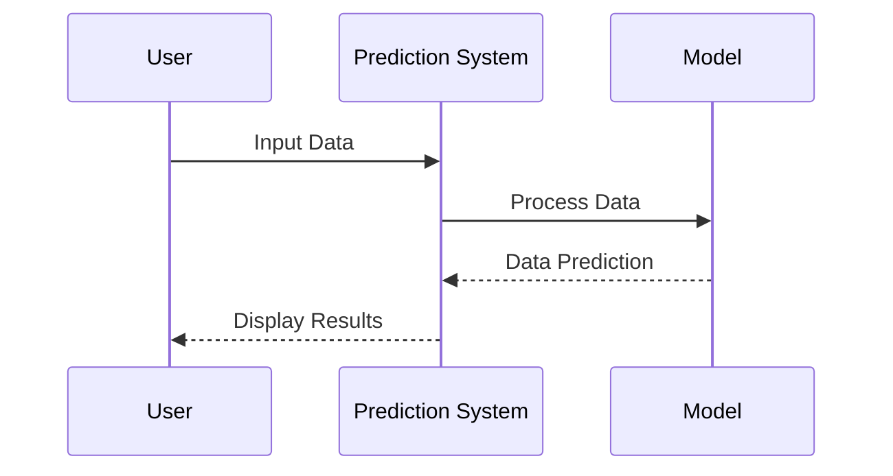
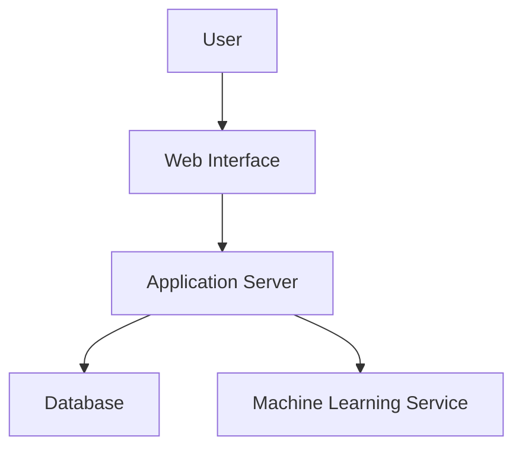

# Project Documentation for Heart Stroke Prediction

## Overview
This document aims to provide a comprehensive overview of the Heart Stroke Prediction project, including various diagrams and a comparative analysis of different project types.

## Gantt Chart


## PERT Chart


## Entity-Relationship Diagram (E-R Diagram)


## Data Flow Diagrams (DFD Level 0/1/2)
### Level 0:


### Level 1:


### Level 2:


## Sequence Diagrams


## Class Diagram
```mermaid
    classDiagram
        class User {
            +String name
            +submitData()
            +receiveResults()
        }
        class Prediction {
            +predict()
        }
        class Model {
            +train()
            +validate()
        }
        User --> Prediction;
        Prediction --> Model;
```  

## Deployment Diagram


## Comparison Guide for Different Project Types
| Project Type          | Description                                   | Advantages                        | Disadvantages              |
|-----------------------|-----------------------------------------------|-----------------------------------|---------------------------|
| Data Analysis         | Analyzing data patterns                       | Insightful results               | Resource-intensive         |
| Predictive Modeling   | Predicting outcomes based on data            | High accuracy                    | Requires significant data  |
| Real-time Analytics   | Analyzing data in real-time                  | Valuable for immediate decisions  | Complex infrastructure needed |